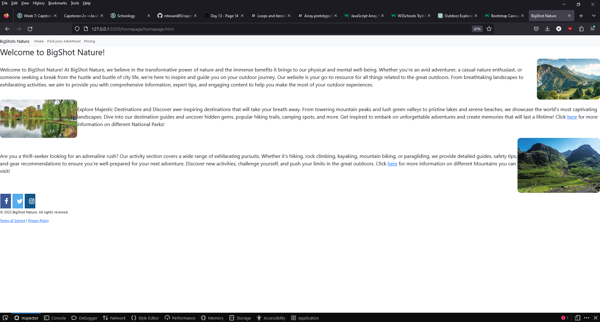
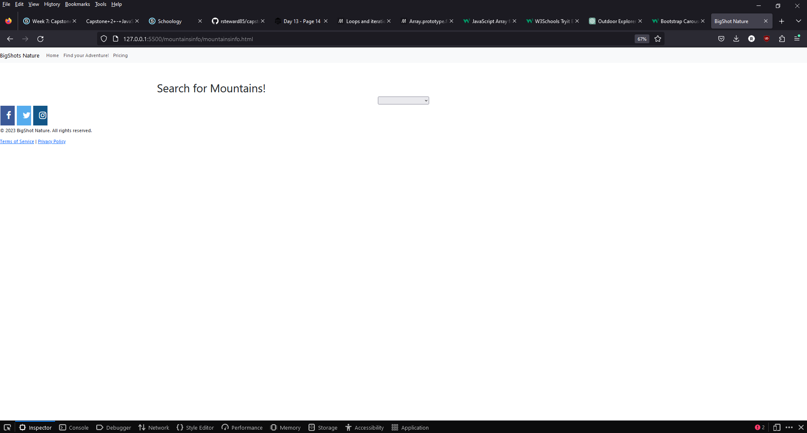
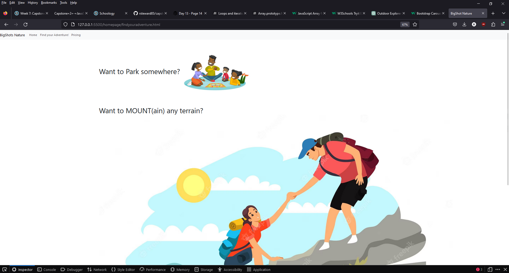
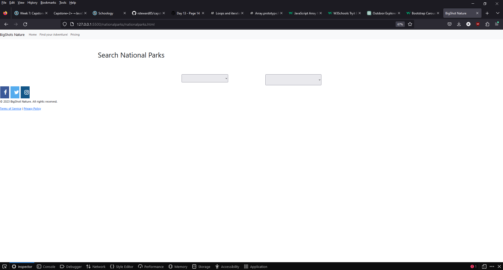

# BigShot Nature Website

Welcome to the BigShot Nature website! This website is designed to provide information and resources for nature lovers and outdoor enthusiasts.

## Description

The BigShot Nature website is a platform where users can find information about national parks and mountains. It offers a user-friendly interface and a variety of features to enhance the user experience.

## Features

- Navigation menu: Easily navigate through different sections of the website.
- National Parks: Explore information about various national parks, including location, city, state, and address.
- Mountains: Get details about different mountains, including their names, descriptions, and coordinates.
- Social Media Integration: Connect with us on Facebook, Twitter, and Instagram to stay updated with the latest news and updates.
- Responsive Design: The website is optimized for different devices and screen sizes to ensure a seamless experience for users.

## screenshots

## Usage

Once you have the website up and running, you can:

- Explore the different sections of the website using the navigation menu.
- Click on the "Find your Adventure!" link to discover exciting outdoor activities.
- Visit the National Parks and Mountains sections to get detailed information about specific locations.
- Connect with us on social media platforms to stay connected and share your experiences.

## Webpages

The BigShot Nature website consists of the following webpages:

- **Home**: The landing page of the website that provides an overview of the website and its features.
- **National Parks**: This page displays a list of national parks. Clicking on a park will open a detailed page with information about that park.
- **Mountains**: This page showcases different mountains. Clicking on a mountain will open a detailed page with information about that mountain.
- **Find Your Adventure**: This page helps users find exciting outdoor activities based on their preferences and location.
- **Contact**: Users can use this page to get in touch with us and provide feedback or inquiries.

Feel free to navigate through these webpages and explore the rich content and resources available.

## Contributing

I received help from my classmates on this project

## License

The BigShot Nature website is released under the [MIT License](LICENSE). Feel free to use, modify, and distribute the code as per the terms of the license.
